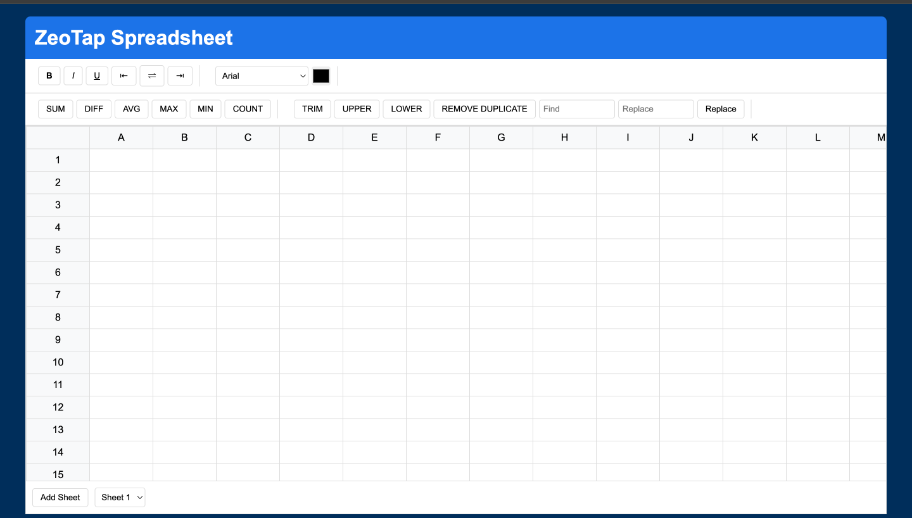
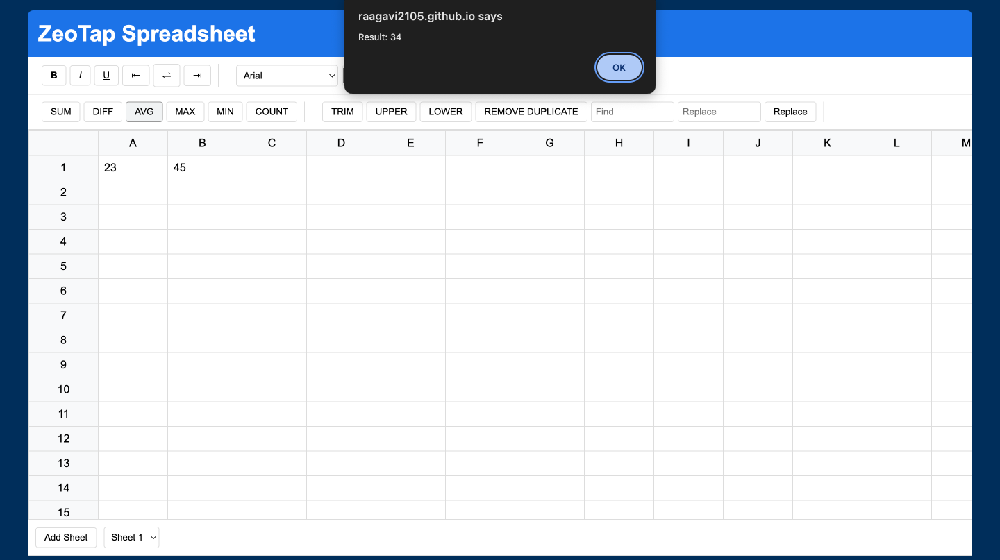

# 📊 Zeotap Sheets

**A web application that mimics Google Sheets, focusing on mathematical operations, data entry, and intuitive formatting features.**

---

## 🚀 Features

1. **Spreadsheet Interface**
   - Google Sheets-style UI with a toolbar, formula bar, and spreadsheet grid.
   - Drag-and-drop functionality for formulas and selections.
   - Dynamic addition, deletion, and resizing of rows and columns.
   - Basic formatting options: bold, italic, font size, and colors.

2. **Mathematical Functions**
   - **SUM**: Calculate the sum of selected cells.
   - **AVERAGE**: Compute the average of a range.
   - **MAX**/**MIN**: Find the maximum or minimum values in a range.
   - **COUNT**: Count numeric entries in a range.

3. **Data Quality Tools**
   - **TRIM**: Remove leading and trailing spaces in cells.
   - **UPPER/LOWER**: Convert text to uppercase or lowercase.
   - **REMOVE_DUPLICATES**: Eliminate duplicate rows in a selected range.
   - **FIND_AND_REPLACE**: Search and replace text across cells.

4. **Usability Enhancements**
   - Supports multiple data types (text, numbers, dates).
   - Basic data validation for numeric-only cells.
   - Multiple sheet management: add, delete, and switch between sheets.

5. **Bonus Features**
   - Save and load sheets.
   - Data visualization: Create dynamic charts and graphs.

---

## 💻 Tech Stack

- **Frontend**: HTML, CSS, JavaScript


---

## 📸 Screenshots

### Spreadsheet Interface  


### Mathematical Features  


### Mathematical Functions  


---

## 🌐 Live Demo

[View Live Demo](https://raagavi2105.github.io/zeotap_sheets/)

---

## 🎥 Video Demo

[Watch the Project in Action](https://youtu.be/vZ_AAsvfhYo)

---

## 🏁 Getting Started

1. Clone the repository:
   ```bash
   git clone https://github.com/raagavi2105/zeotap_sheets.git
